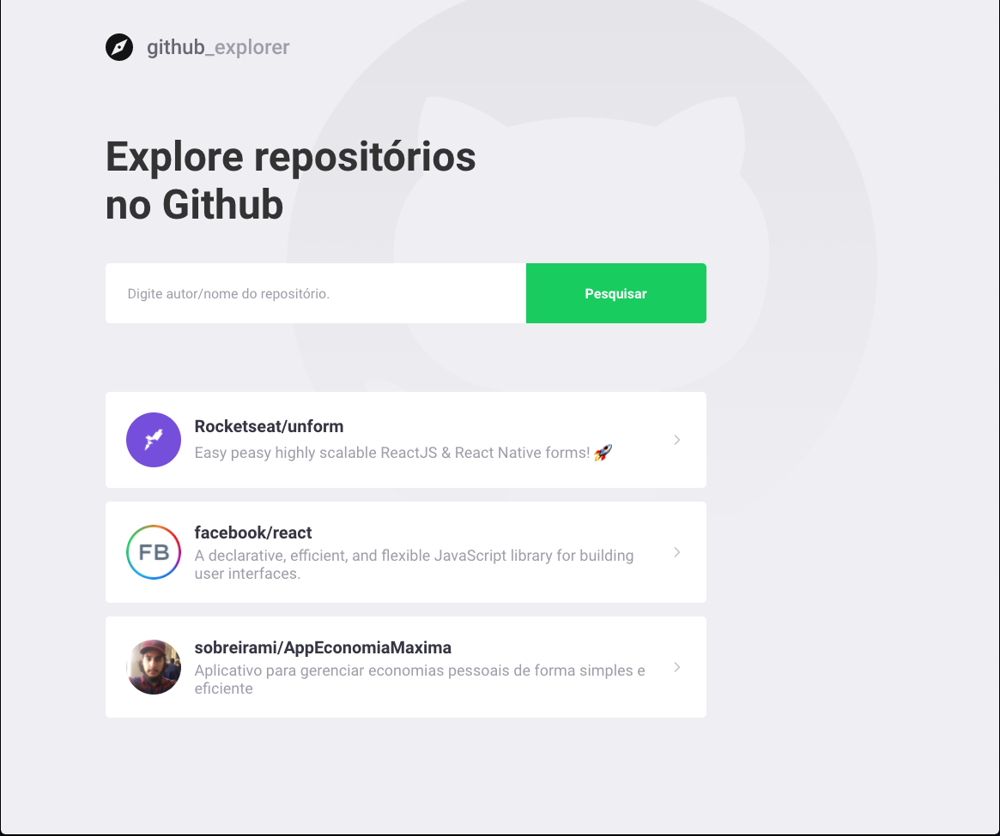

<h1 align="center">
    
</h1>

<h4 align="center">
  🚀 GitHub Explorer
</h4>

  
  

  <a href="#git-tech">Tecnologias</a>&nbsp;&nbsp;&nbsp;|&nbsp;&nbsp;&nbsp;
  <a href="#-projeto">Projeto</a>&nbsp;&nbsp;&nbsp;|&nbsp;&nbsp;&nbsp;
  <a href="#-layout">Layout</a>&nbsp;&nbsp;&nbsp;|&nbsp;&nbsp;&nbsp;

 

  

## Tecnologias

Esse projeto foi desenvolvido com as seguintes tecnologias:

- [React.js](https://reactjs.org/)

## 💻 Projeto

Projeto desenvolvido durante o curso GoStack da Rockeatseat e tem por objetivo de pesquisar e listar algumas informações
dos repositórios informados.

## 🔖 Layout

Você pode conferir o layout através [desse link](https://www.figma.com/file/2uMYYK5pll3X5xzpGqrifS/Github-Explorer_Michel?node-id=1%3A373).
